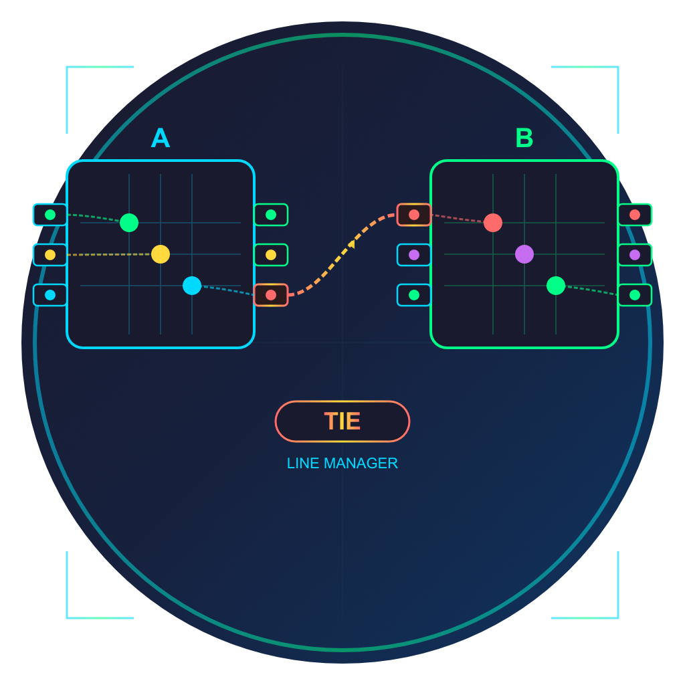

# Tie-Line Manager

A cross-platform Electron application that connects two broadcast video routers and manages tie-lines between them, presenting them as a single unified virtual router. Operators can route any source from either router to any destination on either router seamlessly through the virtual crosspoint matrix.

<p align="center">
  
</p>

## What Are Tie-Lines?

In broadcast environments, tie-lines are dedicated physical connections between two routers that allow signals to pass from one router to the other. For example, if Router A has cameras and Router B has monitors, a tie-line carries a camera signal from Router A's output into Router B's input, making it available to Router B's destinations.

Tie-Line Manager automates this process:
- Configures which ports on each router serve as tie-lines
- Hides tie-line ports from the operator's view
- Automatically allocates tie-lines when cross-router routes are requested
- Presents both routers as one seamless virtual router

## Features

- **Virtual Router View** - XY crosspoint grid showing combined inputs and outputs from both routers as one matrix
- **Multiple Protocol Support** - Connect to routers via Blackmagic VideoHub, SW-P-08 (Calrec/SAM/Grass Valley), or GV Native protocols
- **Bi-directional Tie-Lines** - Configure tie-lines in both A→B and B→A directions
- **Automatic Tie-Line Allocation** - Cross-router routes automatically claim and release tie-lines as needed
- **Tie-Line Port Labeling** - Tie-line ports are automatically labeled on the physical routers for easy identification
- **Salvos** - Capture and recall routing presets with destination selection
- **Output Locks** - Lock destinations to prevent accidental route changes
- **Label Editing** - Rename inputs and outputs with fill and increment support
- **Drag-to-Route** - Click and drag across the XY grid for quick sequential routing
- **Physical Port Numbers** - See the actual router port numbers alongside virtual indices
- **Router Colour Coding** - Inputs and outputs colour-coded by which physical router they belong to
- **Import/Export Salvos** - CSV import and export with duplicate resolution
- **Auto-Connect** - Automatically connect to configured routers on launch
- **Auto-Reconnect** - Automatically reconnect if a router connection drops
- **Persistent Settings** - All configuration saved across app restarts

## How It Works

```
┌──────────────────┐                          ┌──────────────────┐
│    Router A       │      Tie-Lines           │    Router B       │
│                   │   ┌──────────────┐       │                   │
│  Inputs  Outputs ─┼──►│  A→B Lines   │──────►┼─ Inputs  Outputs │
│                   │   └──────────────┘       │                   │
│  Inputs ─┼───────◄┼───│  B→A Lines   │◄──────┼─ Outputs         │
│                   │   └──────────────┘       │                   │
└──────────────────┘                          └──────────────────┘
         │                                              │
         └──────────────┐  ┌────────────────────────────┘
                        ▼  ▼
               ┌─────────────────────┐
               │   Virtual Router     │
               │                      │
               │  All non-tie-line    │
               │  inputs & outputs    │
               │  from both routers   │
               │  shown as one matrix │
               └─────────────────────┘
```

## Installation

### Building from Source

#### Prerequisites

- Node.js 16 or later
- npm

#### Setup

```bash
# Clone the repository
git clone https://github.com/videojedi/TieLineManager.git
cd TieLineManager

# Install dependencies
npm install

# Start the application
npm start

# Build for your platform
npm run build:mac   # macOS
npm run build:win   # Windows
```

## Usage

### 1. Connect Routers

Enter the IP address and port for each router (A and B), select the protocol, and connect. Both routers must be connected before tie-lines can be configured.

### 2. Configure Tie-Lines

Switch to the **Tie-Lines** tab to define which physical ports serve as tie-lines between the routers:

- **A→B Tie-Lines**: Select a Router A output and Router B input pair
- **B→A Tie-Lines**: Select a Router B output and Router A input pair
- Add as many tie-lines as needed in each direction (more tie-lines = more simultaneous cross-router routes)

### 3. Route Signals

Switch to the **Routing** tab to see the unified virtual router. The XY grid shows all non-tie-line inputs and outputs from both routers:

- Click a crosspoint to make a route
- Drag across crosspoints for sequential routing
- Routes within the same physical router are made directly
- Routes between routers automatically use an available tie-line

### 4. Salvos

Switch to the **Salvos** tab to capture and recall routing presets:

- Select destinations from the left column
- Click **Capture Selected** or **Capture All** to save the current routing state
- Click a saved salvo to recall it
- Export/import salvos as CSV files

## Supported Protocols

| Protocol | Default Port | Description |
|----------|-------------|-------------|
| Blackmagic VideoHub | 9990 | Text-based protocol for Blackmagic routers |
| SW-P-08 | 8910 | Binary protocol for Calrec, SAM, Grass Valley routers |
| GV Native | 12345 | Grass Valley Series 7000 native protocol |

## Configuration Options

| Setting | Description |
|---------|-------------|
| Router A/B Address | IP address of each router |
| Router A/B Port | TCP port for each router |
| Protocol | Communication protocol for each router (can differ) |
| Auto-Connect | Automatically connect on launch |
| Auto-Reconnect | Reconnect if connection drops |

## Project Structure

```
TieLineManager/
├── package.json
├── README.md
├── .gitignore
├── build/
│   ├── icon.icns              # macOS icon
│   ├── icon.png               # Windows/Linux icon
│   └── icon.svg               # Source icon
├── icons/
│   └── VWLogo.png             # Company logo
└── src/
    ├── main.js                 # Electron main process
    ├── preload.js              # Preload script for secure IPC
    ├── index.html              # UI and renderer process
    ├── virtual-router.js       # Virtual router abstraction
    ├── tie-line-engine.js      # Tie-line state management
    ├── videohub-controller.js  # Blackmagic VideoHub client
    ├── swp08-controller.js     # SW-P-08 client
    └── gvnative-controller.js  # GV Native client
```

## Development

```bash
# Run in development mode (with DevTools)
npm run dev
```

## Troubleshooting

### "ELECTRON_RUN_AS_NODE" Error

If you see errors about Electron running as Node, the start script handles this automatically. If issues persist:

```bash
unset ELECTRON_RUN_AS_NODE && npm start
```

### Cross-Router Routes Failing

- Ensure tie-lines are configured in the correct direction
- Check that tie-line ports are not already in use (view tie-line status in the Tie-Lines tab)
- Verify both routers are connected

### Routes Not Appearing

- Both routers must be connected for the virtual router to display
- If a router reconnects, tie-line state is automatically reconstructed from physical routing

## Related Projects

- [Router Protocol Simulator](https://github.com/videojedi/VideoHubSim) - Simulate VideoHub, SW-P-08, and GV Native routers for testing without physical hardware

## License

MIT License - See [LICENSE](LICENSE) for details.
